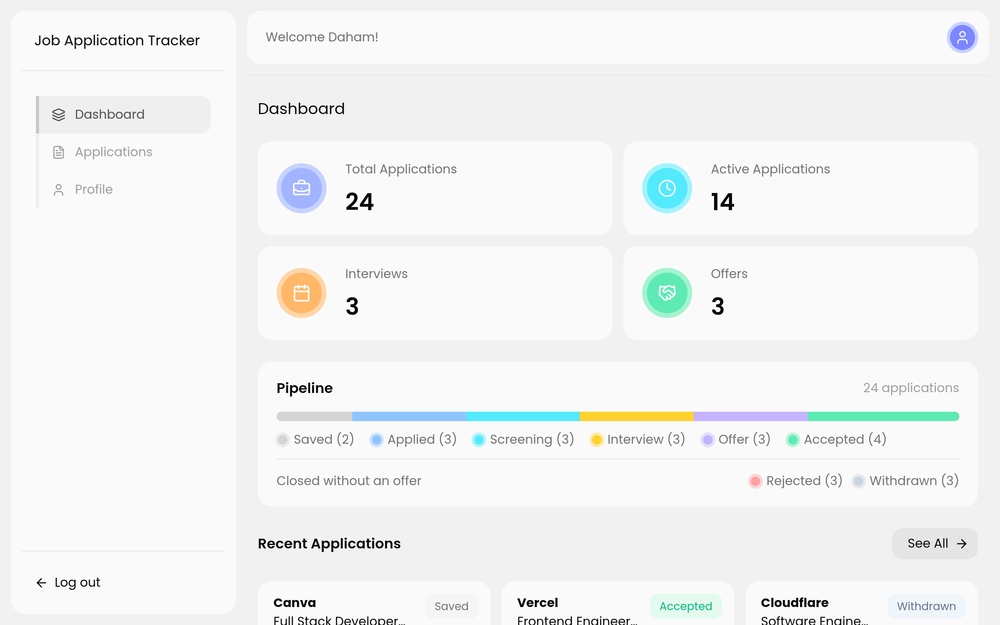
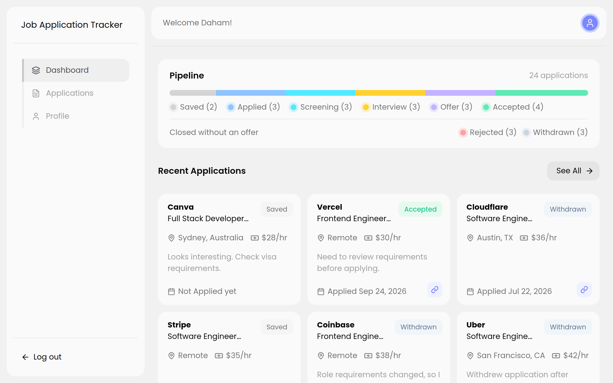
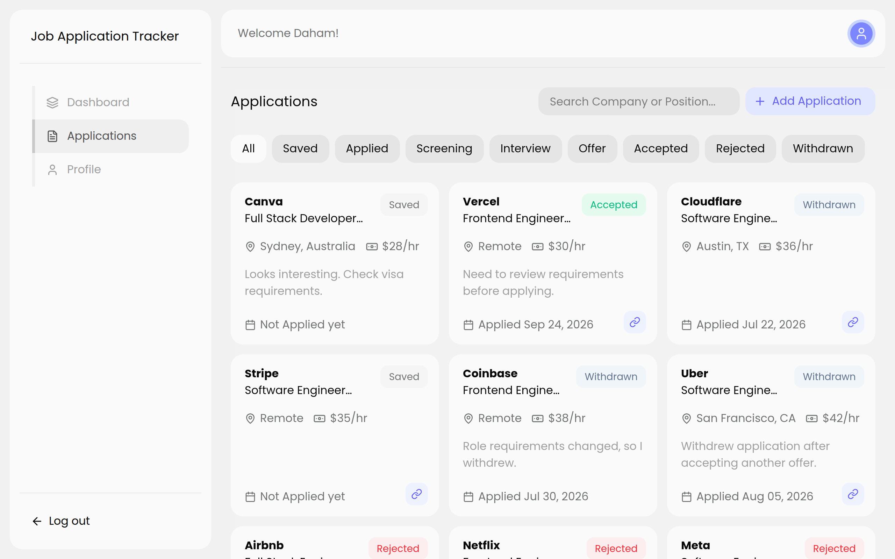

# Job Application Tracker

A simple web app to manage and track job applications throughout the hiring process. Built as a learning project with Next.js, TypeScript, and MySQL.

## Screenshots

### Dashboard



### Dashboard - Recent Applications



### Applications



## Features

- User signup and login with secure, hashed passwords
- JWT-based authentication with protected routes
- Add, edit, and delete job applications
- Track application status through different stages
- Search applications by company, position, and location
- Filter applications by status
- Store job location, salary, application date, notes, and job posting URL
- Dashboard with total applications, active applications, interviews, and offers
- Visual application pipeline showing application progress
- View recently updated applications
- Responsive layout for desktop and mobile

## Application Statuses

Applications can be tracked through the following stages:

- Saved
- Applied
- Screening
- Interview
- Offer
- Accepted
- Rejected
- Withdrawn

## Tech Stack

- **Framework:** Next.js 16 (App Router) with React 19 and TypeScript
- **Database:** MySQL
- **Auth:** JWT sessions (`jose`) with `bcrypt` for password hashing
- **Styling:** Tailwind CSS
- **Icons:** Lucide React and React Icons
- **Date Handling:** date-fns and React Day Picker

## Getting Started

### Prerequisites

- Node.js 18 or later
- A MySQL database (local install or a hosted service)

### 1. Clone the repository

```bash
git clone https://github.com/dahamdevtools/job-application-tracker.git
cd job-application-tracker
```

### 2. Install dependencies

```bash
npm install
```

### 3. Set up the database

Run the SQL script in `database/schema.sql` against your MySQL server. This creates the `job_application_tracker_db` database along with the `users`, `statuses`, and `applications` tables.

```bash
mysql -u your_username -p < database/schema.sql
```

After creating the database, add the default application statuses:

```sql
USE job_application_tracker_db;

INSERT INTO statuses (status) VALUES
('Saved'),
('Applied'),
('Screening'),
('Interview'),
('Offer'),
('Accepted'),
('Rejected'),
('Withdrawn');
```

### 4. Configure environment variables

Create a `.env.local` file in the project root:

```env
DATABASE_HOST=localhost
DATABASE_PORT=3306
DATABASE_USER=your_username
DATABASE_PASSWORD=your_password
DATABASE_NAME=job_application_tracker_db

JWT_SECRET=a_long_random_secret_string
```

### 5. Run the development server

```bash
npm run dev
```

Open http://localhost:3000 in your browser and create an account to get started.

## Project Structure

```text
app/
  (auth)/          Login and signup pages
  (dashboard)/     Dashboard, applications, and profile pages
  api/             API routes for authentication, applications, and statuses
components/        Reusable UI components and application modals
lib/               Database connection and authentication helpers
database/           MySQL schema
types/              Shared TypeScript types
public/             Static assets and screenshots
```

## Notes

This project was built for learning purposes, with a focus on practicing full-stack development using Next.js, MySQL, authentication, API routes, and CRUD operations.

Feel free to fork it, explore the code, or use it as a starting point for your own job application tracker.

## License

This project is open source and available for anyone to use or learn from.
